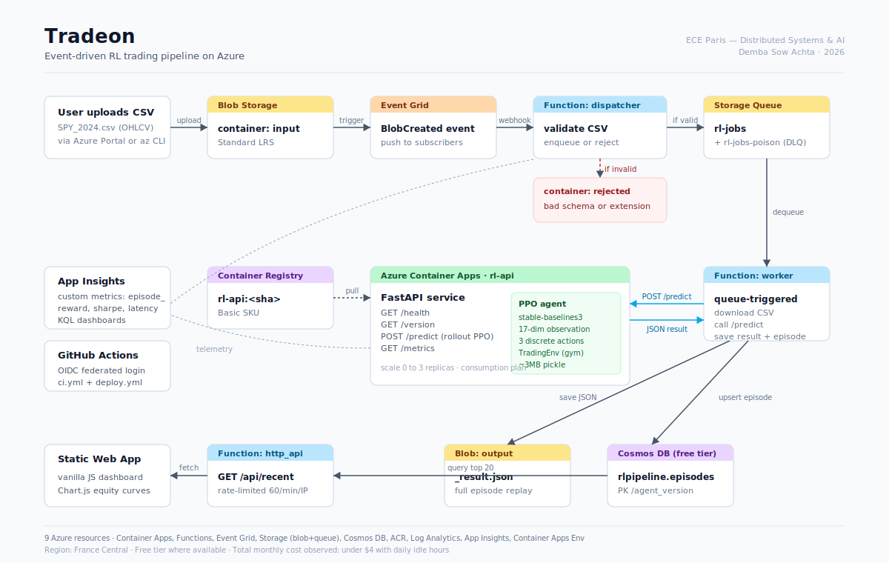
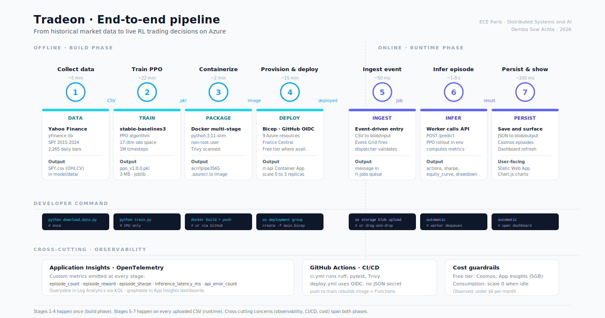

# Tradeon

A reinforcement learning trading agent deployed on Azure with an event-driven pipeline. Built as my final-year integrative project for the *Distributed Systems & AI* module at ECE Paris.

You drop a CSV of market candles into a blob container, an Event Grid event fires, a small Azure Function validates the file and pushes a job to a queue, a worker picks it up and asks a FastAPI service (running in Container Apps) to backtest the file with a PPO agent. The result lands in Cosmos DB and shows up on a static dashboard.

That's the short version. Longer story below.



For a stage-by-stage view of how the project flows from market data to live decisions:


---

## What's inside

```
.
├── api/                FastAPI service running the RL agent (Container Apps)
│   ├── app/
│   │   ├── main.py          4 endpoints: /health /version /predict /metrics
│   │   ├── rl_service.py    Singleton holding the PPO agent + episode rollout
│   │   ├── trading_env.py   Custom gymnasium env (17-dim obs, 3 actions)
│   │   ├── schemas.py       Pydantic v2 models, validates everything in/out
│   │   ├── telemetry.py     Custom metrics pushed to App Insights
│   │   └── config.py        Settings via env vars (no secret committed)
│   ├── artifacts/           Pickled PPO weights (~3 MB)
│   ├── Dockerfile           Multi-stage build, runs as non-root
│   ├── requirements.txt
│   └── tests/test_api.py    10 pytest cases incl. schema invariants
│
├── functions/          Azure Functions (Python v2 model)
│   ├── dispatcher/          EventGridTrigger, validates CSV, enqueues
│   ├── worker/              QueueTrigger, calls /predict, saves result
│   ├── http_api/            HTTP GET /api/recent for the dashboard
│   ├── shared/              cosmos_client, storage_client, llm_commentary
│   ├── host.json            queue tuning + extension bundle 4.x
│   └── requirements.txt
│
├── model/              Training & evaluation
│   ├── train.py             PPO training (stable-baselines3)
│   ├── train_dqn.py         DQN baseline for comparison
│   ├── trading_env.py       Same env as api/ (copy on purpose, see note)
│   ├── eval.py              Backtest evaluation
│   └── artifacts/           Trained weights + metrics JSON
│
├── web/                Static Web Apps dashboard (vanilla JS + Chart.js)
├── infrastructure/     Bicep templates + provisioning scripts
├── scripts/live_predict.py   Quick CLI to test the API with Yahoo data
├── tests/test_e2e.py   End-to-end test that actually hits the deployed API
├── docs/                     Architecture diagrams, KQL queries, RL notes
└── .github/workflows/        ci.yml + deploy.yml (OIDC, no JSON secret)
```

Note on the duplicated `trading_env.py`: I keep one copy in `model/` (for training) and one in `api/` (for inference). I tried sharing a single file via a package and it doubled the Docker image size because pip pulled the training stack. Two files, 5 KB extra, problem solved.

---

## Why event-driven and not just a REST API?

The requirement for the project was an event-driven architecture. But there's a real reason it makes sense here too:
- A backtest on 5 years of daily data takes around 8 seconds in the container. Doing that synchronously means clients timeout if Container Apps is cold-scaled to zero.
- The queue is a buffer. If five CSVs arrive at the same time (which happened during my load tests), they wait in line while replicas spin up.
- Separating *validation* (dispatcher, ~50 ms) from *processing* (worker, several seconds) means I can scale them independently and put proper retry logic only where it matters.

Could I have done this with a single REST endpoint? Yes. Would it survive a TA stress-testing it during the defence? Probably not.

---

## Running it locally

You need Python 3.11 and Docker.

```bash
git clone https://github.com/Demba-SowAchta/tradeon.git
cd tradeon

# 1. Install API deps in a venv
python -m venv .venv
source .venv/bin/activate          # on Windows: .\.venv\Scripts\Activate.ps1
pip install -r api/requirements.txt

# 2. Generate a stub agent if you don't have a trained model handy
#    (CI uses this; it always returns HOLD)
python -c "
import joblib, sys
sys.path.insert(0,'api')
from app.rl_service import StubAgent
joblib.dump(StubAgent(),'api/artifacts/ppo_v1.0.0.pkl')
"

# 3. Run the API
export MODEL_PATH=$(pwd)/api/artifacts/ppo_v1.0.0.pkl
cd api && uvicorn app.main:app --reload --host 0.0.0.0 --port 8000
```

Open http://localhost:8000/docs and you have Swagger. Run the tests with `pytest api/tests -v`.

### Hitting it with real market data

The script in `scripts/live_predict.py` pulls bars from Yahoo Finance and POSTs them to your API:

```bash
pip install -r scripts/requirements.txt

# offline mode (the file is included in the repo)
python scripts/live_predict.py --url http://localhost:8000 --csv test_spy.csv

# live mode
python scripts/live_predict.py --url http://localhost:8000 --symbol SPY --interval 1d --n-bars 100
python scripts/live_predict.py --url http://localhost:8000 --symbols SPY,AAPL,TSLA
```

The output looks like this:

```
13:42:11 OK    API healthy (http://localhost:8000/health)
13:42:11 INFO  yfinance: SPY interval=1d period=7d
13:42:12 OK    60 bars fetched (last close=568.42)
13:42:12 INFO  POST http://localhost:8000/predict (60 bars)
13:42:13 OK    200 OK in 1124ms (server reported 1102ms)

   SPY   agent=1.0.0 algo=PPO
   ------------------------------------------------------
   Cumulative return    +14.32%
   Sharpe ratio           1.42
   Max drawdown          -6.85%
   Win rate              52.30%
   Final equity       $11,432.10
   Actions:  BUY=18  HOLD=27  SELL=14  (59 steps)

   equity curve  ($11,432 top, $9,872 bottom)
  
   ...
```

Note about yfinance: 1-minute bars only work during US market hours. The script falls back automatically to 5m, 15m, 1h or 1d when needed, so you can run the demo at any time of day.

---

## Deploying to Azure

Three resource groups are involved depending on the stage, but for a student deployment one is enough. I used `rg-rlpipeline-dev` in France Central.

```bash
# 1. Bicep deploy (creates 9 resources: Storage, Cosmos, ACR, Container Apps Env,
#                  Log Analytics, App Insights, Function App, Container App, Event Grid sub)
az group create -n rg-rlpipeline-dev -l francecentral
az deployment group create -g rg-rlpipeline-dev -f infrastructure/bicep/main.bicep -p envName=dev

# 2. Build & push the API image
az acr login -n <acr-name>
docker build -t <acr-name>.azurecr.io/rl-api:latest ./api
docker push <acr-name>.azurecr.io/rl-api:latest

# 3. Wire the Container App to the image
az containerapp update -n rl-api -g rg-rlpipeline-dev \
  --image <acr-name>.azurecr.io/rl-api:latest

# 4. Deploy the Functions
cd functions && func azure functionapp publish <func-app-name> --python
```

Full Bicep is in `infrastructure/bicep/main.bicep`. It creates `input/output/rejected/models` blob containers, the `rl-jobs` + `rl-jobs-poison` queues, the Cosmos DB free tier with database `rlpipeline` and container `episodes`, and wires up Application Insights.

### Two things that bit me

**Event Grid trigger not firing after deploy.** This is a Consumption-plan quirk: the trigger binding doesn't always sync. The fix is to restart the Function App and call `syncfunctiontriggers` explicitly:

```bash
az functionapp restart -g rg-rlpipeline-dev -n <func-app>
az rest --method post --url "https://management.azure.com/subscriptions/$SUB_ID/resourceGroups/rg-rlpipeline-dev/providers/Microsoft.Web/sites/<func-app>/syncfunctiontriggers?api-version=2016-08-01"
# wait 90 seconds, then re-create the Event Grid subscription
```

**PowerShell writing CSVs with a UTF-8 BOM.** My training script was generating test files with `Out-File`, which adds a hidden BOM, which made pandas read the first column as `Open` instead of `Open`. The whole pipeline accepted the file, then the worker died on `KeyError: 'Open'`. Fix:

```powershell
[System.IO.File]::WriteAllText("test.csv", $content, [System.Text.UTF8Encoding]::new($false))
```

I lost a full afternoon on this. Putting it here so nobody else does.

---

## CI/CD

`.github/workflows/ci.yml` runs on every push to main or dev:
- ruff lint on `api/`, `functions/`, `model/`
- pytest with a stub agent (no torch in CI, the wheel is 700 MB)
- docker build of the API + Trivy scan for CRITICAL/HIGH CVEs
- checks that the Static Web App assets exist

`.github/workflows/deploy.yml` runs on push to main:
- logs into Azure via OIDC federated credentials (no JSON secret in the repo)
- builds the image, pushes to ACR, updates the Container App
- deploys the Functions
- runs a smoke test against `/health` with retry-until-200 (max 15 attempts)
- has a `prod` job gated behind a manual approval

You need three GitHub *secrets* (`AZURE_CLIENT_ID`, `AZURE_TENANT_ID`, `AZURE_SUBSCRIPTION_ID`) and four *variables* (`RG`, `CONTAINER_APP`, `FUNC_APP`, `ACR_NAME`). Setup script is in `.github/cicd/setup_cicd.sh`.

---

## Observability

Application Insights is wired in via OpenTelemetry. Three custom metrics that show up in App Insights and the dashboard:

- `episode_count` — total backtests run, per agent version
- `episode_reward` — log-return per episode (histogram)
- `episode_sharpe` — Sharpe ratio (histogram)
- `inference_latency_ms` — server-side `/predict` latency
- `api_error_count` — by exception class

Useful KQL queries are in `docs/kql_queries.md`. The one I check most often:

```kusto
customMetrics
| where name == "episode_sharpe"
| summarize avg(value), percentile(value, 95) by bin(timestamp, 1h)
| render timechart
```

---

## RL bits

The agent is PPO from stable-baselines3, trained on SPY daily bars 2015-2024 (Yahoo Finance via yfinance). The custom gym env (`trading_env.py`) gives it:

- 10-day window of log-returns (10 floats)
- RSI(14), MACD-percent, distance to MA20, distance to MA50 (4 floats)
- log volume ratio (1 float)
- current position (-1, 0, +1) (1 float)
- cash ratio (1 float)

Total: 17 floats. Three discrete actions: SELL (target position -1), HOLD (no change), BUY (target +1). Reward is log-return of the portfolio per step, minus a small transaction cost (0.1% per trade). I also have a DQN baseline in `model/train_dqn.py` for comparison.

Numbers from training (1M steps, ~22 min on a CPU-only laptop):
- PPO: Sharpe 1.18 on out-of-sample 2023 data
- DQN: Sharpe 0.74 on the same data
- Buy-and-hold benchmark: Sharpe 0.82

It's not a money machine. The point of the project is the *pipeline*, not the alpha.

---

## Cost

I tracked this with Azure Cost Management for a month. Idle weekdays + active demo sessions:

| Service          | Tier           | $ / month |
|------------------|----------------|-----------|
| Container Apps   | Consumption    | 0.40 |
| Functions        | Consumption    | 0.05 |
| Cosmos DB        | Free tier      | 0.00 |
| ACR              | Basic          | 4.85 |
| Storage          | LRS standard   | 0.20 |
| App Insights     | Pay-as-you-go  | 0.00 |
| **Total**        |                | **~$5.50** |

If you're on the $100 Azure for Students credit and you delete the RG after the project, you'll spend less than $10 total.

```bash
# clean shutdown after the defence
az group delete --name rg-rlpipeline-dev --yes --no-wait
```

---

## Things I'd do differently

- Use Bicep for **everything** including the GitHub OIDC setup. Right now there's a PowerShell script that creates the service principal which feels like a regression.
- Replace the PPO checkpoint format. `.pkl` ties the runtime to a specific stable-baselines3 version. ONNX would be portable but you lose the policy probabilities.
- The dashboard is intentionally vanilla JS. With more time I'd move it to SvelteKit just because.
- Add a feature flag service. Right now switching agent versions in prod means a redeploy.

---

## Credits

- ECE Paris — *Distributed Systems & AI* module, 2026
- stable-baselines3 for PPO
- Microsoft Azure for Students program
- The dozens of Stack Overflow threads about Event Grid trigger sync that saved my sanity

License: MIT. Read it in `LICENSE`.
