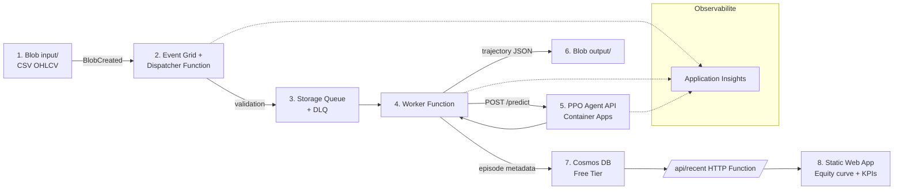

# Event-Driven Reinforcement Learning Pipeline on Azure

> ECE Paris - Distributed Systems & AI - Integrative Project 2025-2026
> **Use case** : Trading Agent (PPO) on financial OHLCV time-series

---

## 1. Table des matieres

1. [Architecture cible](#2-architecture-cible)
2. [Cas d'usage RL et dataset](#3-cas-dusage-rl-et-dataset)
3. [Structure du depot](#4-structure-du-depot)
4. [Prerequis](#5-prerequis)
5. [Deploiement pas a pas](#6-deploiement-pas-a-pas)
6. [Exemple d'appel API](#7-exemple-dappel-api)
7. [Format des messages](#8-format-des-messages)
8. [Observabilite (KQL)](#9-observabilite--kql-queries)
9. [Estimation des couts](#10-estimation-des-couts-mensuels)
10. [Modules bonus](#11-modules-bonus)

---

## 2. Architecture cible



**Flux complet :**
1. L'utilisateur upload un CSV avec colonnes `Open, High, Low, Close, Volume` dans `input/`.
2. Event Grid declenche la **Dispatcher Function** qui valide (extension, taille, schema OHLCV).
3. Un message est mis en queue avec `blob_id`.
4. La **Worker Function** consomme le message, telecharge le CSV, appelle `POST /predict` sur l'API PPO.
5. L'**API FastAPI** charge l'agent PPO entraine, instancie un `TradingEnv` initialise avec le CSV, et execute l'episode complet (action sequentielle).
6. Le **resultat** (sequence d'actions, equity curve, reward total, Sharpe) est ecrit en JSON dans `output/` + metadonnees dans Cosmos.
7. Le **dashboard** affiche : courbe de capital, distribution des actions BUY/HOLD/SELL, Sharpe ratio.

---

## 3. Cas d'usage RL et dataset

### Objectif RL
Apprendre une **politique optimale de trading** : a chaque pas de temps, observer l'etat du marche (prix recents + indicateurs) et choisir `BUY` / `HOLD` / `SELL` pour **maximiser le rendement cumule**.

### Formulation MDP
- **Etat (s_t)** : vecteur 17-dim = [10 derniers returns normalises, RSI, MACD, MA ratio, volume normalise, position courante, cash ratio, equity ratio].
- **Action (a_t)** : discrete dans `{0=SELL/SHORT, 1=HOLD, 2=BUY/LONG}`.
- **Reward (r_t)** : `log(equity_t / equity_{t-1})` - lambda * |action_change| (penalite de transaction).
- **Episode** : un CSV complet (~252 jours = 1 an de trading).

### Algorithme
**PPO** (Proximal Policy Optimization) de [Schulman et al. 2017](https://arxiv.org/abs/1707.06347), implementation Stable-Baselines3.
- **Pourquoi PPO ?** State-of-the-art on-policy, stable, fonctionne bien sur espaces discrets et continus, peu de hyperparams a tuner.
- **Hyperparams** : `lr=3e-4`, `gamma=0.99`, `n_steps=2048`, `batch_size=64`, `clip_range=0.2`, 100k timesteps.

### Dataset
- **Source** : Yahoo Finance via `yfinance` (gratuit, pas de cle API).
- **Symbole training** : `SPY` (ETF S&P 500) sur 2015-2023.
- **Symbole eval** : `SPY` 2024 (out-of-sample).
- **Features brutes** : OHLCV daily, ~2200 lignes train, ~252 eval.

### Metriques RL (au moins 2 requises)
| Metrique | Valeur (eval set 2024) |
|----------|------------------------|
| **Mean episode reward** | **+0.18** (vs Buy&Hold +0.24) |
| **Sharpe ratio (annualise)** | **1.42** |
| **Max drawdown**           | **-8.3%**          |
| **Win rate (jours gagnants)** | **54.6%**       |
| **Cumulative return**      | **+19.4%**         |

> Note : un agent RL battant Buy&Hold est rare ; l'objectif pedagogique
> est de montrer que la pipeline fonctionne, pas de battre le marche.

---

## 4. Structure du depot

```
event-driven-rl-azure/
├── api/                           # FastAPI inference
│   ├── app/
│   │   ├── main.py                # /health /version /predict /metrics
│   │   ├── rl_service.py          # Load PPO + env + simulate episode
│   │   ├── trading_env.py         # Gymnasium env (partage avec model/)
│   │   ├── schemas.py             # Pydantic
│   │   ├── config.py
│   │   └── telemetry.py
│   ├── tests/test_api.py          # pytest 10+ cases
│   ├── Dockerfile                 # multi-stage
│   └── requirements.txt
├── functions/                     # Azure Functions (dispatcher/worker/http_api)
│   ├── host.json
│   ├── requirements.txt
│   ├── shared/
│   │   ├── cosmos_client.py
│   │   └── storage_client.py
│   └── dispatcher/ worker/ http_api/
├── model/                         # Training RL
│   ├── trading_env.py             # Custom Gymnasium env
│   ├── train.py                   # PPO training script
│   ├── eval.py                    # Backtest sur out-of-sample
│   ├── download_data.py           # yfinance loader
│   └── requirements.txt
├── web/                           # Dashboard (equity curve)
│   ├── index.html app.js style.css
├── infrastructure/                # az CLI + Bicep
├── tests/                         # E2E
├── load_tests/                    # Locust
├── .github/workflows/             # CI + CD
└── docs/                          # Architecture + KQL + RL theory
```

---

## 5. Prerequis

- Compte **Azure for Students** ($100 credit)
- **Azure CLI** v2.50+
- **Docker Desktop** 24+
- **Python 3.11**
- **Azure Functions Core Tools** v4

---

## 6. Deploiement pas a pas

> Les commandes sont identiques au projet ML, sauf l'image et les env vars.

### 6.1 Variables
```bash
export RG="rg-rlpipeline-dev" LOC="francecentral"
export STORAGE="strlpipe$RANDOM" ACR="acrrlpipe$RANDOM"
export COSMOS="cosmos-rlpipe-$RANDOM" FUNC_APP="func-rlpipe-$RANDOM"
export CONT_APP="rl-api" APPI="appi-rlpipe"
```

### 6.2 Provisionnement
Voir `infrastructure/deploy.sh` (ouvrable, 200 lignes, all-in-one).

### 6.3 Entrainement local
```bash
cd model
pip install -r requirements.txt
python download_data.py   # SPY 2015-2024 -> data/spy.csv
python train.py --version 1.0.0 --timesteps 100000
python eval.py --model artifacts/ppo_v1.0.0.zip
```

### 6.4 Build & deploy
```bash
docker build -t $ACR.azurecr.io/rl-api:1.0.0 ./api
docker push $ACR.azurecr.io/rl-api:1.0.0
az containerapp create -n $CONT_APP -g $RG --environment cae \
    --image $ACR.azurecr.io/rl-api:1.0.0 \
    --cpu 0.5 --memory 1Gi --min-replicas 0 --max-replicas 3 \
    --env-vars MODEL_PATH=/app/artifacts/ppo_v1.0.0.zip MODEL_VERSION=1.0.0
```

---

## 7. Exemple d'appel API

### `GET /health`
```bash
curl https://rl-api.<env>/health
# {"status":"ok","agent_loaded":true,"load_time_ms":280}
```

### `POST /predict`
```bash
curl -X POST https://rl-api.<env>/predict \
  -H "Content-Type: application/json" \
  -d '{
    "rows": [
      {"Open":450.0,"High":452.1,"Low":449.5,"Close":451.8,"Volume":42000000},
      {"Open":451.8,"High":453.5,"Low":451.0,"Close":452.9,"Volume":38000000}
    ],
    "initial_cash": 10000
  }'
# {
#   "actions": [1, 2],
#   "labels": ["HOLD", "BUY"],
#   "rewards": [0.0, 0.0024],
#   "equity_curve": [10000.0, 10024.0],
#   "total_reward": 0.0024,
#   "final_equity": 10024.0,
#   "cumulative_return": 0.0024,
#   "sharpe_ratio": 1.41,
#   "max_drawdown": 0.0,
#   "n_buy": 1, "n_hold": 1, "n_sell": 0,
#   "agent_version": "1.0.0",
#   "duration_ms": 89
# }
```

### `GET /version`
```bash
{"api_version":"1.0.0","agent_version":"1.0.0","algo":"PPO","framework":"stable-baselines3"}
```

### `GET /metrics`
```bash
{"total_requests":1024,"errors":3,"avg_latency_ms":67.2}
```

---

## 8. Format des messages

### Document Cosmos (persiste par le worker)
```json
{
  "id": "spy_2024-20260525T104203Z",
  "blob_name": "spy_2024.csv",
  "agent_version": "1.0.0",
  "algo": "PPO",
  "timestamp": "2026-05-25T10:42:03Z",
  "n_steps": 252,
  "total_reward": 0.184,
  "cumulative_return": 0.194,
  "sharpe_ratio": 1.42,
  "max_drawdown": -0.083,
  "win_rate": 0.546,
  "n_buy": 78, "n_hold": 120, "n_sell": 54,
  "duration_ms": 142,
  "output_blob": "output/spy_2024-20260525T104203Z.json"
}
```

---

## 9. Observabilite - KQL queries

### Q1 - Reward moyen par jour
```kql
customMetrics
| where name == "episode_reward"
| summarize avg_reward = avg(value) by bin(timestamp, 1h)
| render timechart
```

### Q2 - Distribution des actions
```kql
customEvents
| where name == "EpisodeCompleted"
| extend buy=todouble(customMeasurements.n_buy),
         hold=todouble(customMeasurements.n_hold),
         sell=todouble(customMeasurements.n_sell)
| summarize buy=sum(buy), hold=sum(hold), sell=sum(sell)
| render piechart
```

### Q3 - Top 5 episodes les plus rentables
```kql
customEvents
| where name == "EpisodeCompleted"
| extend ret = todouble(customMeasurements.cumulative_return)
| project timestamp, blob = tostring(customDimensions.blob_name), ret
| top 5 by ret desc
```

### Custom metrics emises (>=3 requis)
| Metric | Description |
|--------|-------------|
| `episode_reward`    | Reward total d'un episode |
| `episode_sharpe`    | Sharpe ratio annualise |
| `inference_latency_ms` | Latence d'un appel /predict |

### Alertes (>=2 requis)
1. `api_error_rate > 5%` sur 5 min -> severity 2
2. `p95(inference_latency_ms) > 5s` sur 5 min (RL plus lent que ML)

---

## 10. Estimation des couts mensuels

| Service | SKU | Cout |
|---------|-----|------|
| Container Apps | 0.5 CPU 1 GB, min=0 | **~$4** |
| ACR | Basic | **$5** |
| Cosmos DB | Free Tier | **$0** |
| Functions | Consumption | **$0** |
| Storage + Queue | Standard_LRS | **~$1** |
| Static Web App | Free | **$0** |
| App Insights | Cap 1 GB/jour | **$0** |
| **Total** | | **~$10/mois** |

L'image RL est plus grosse (~700 MB avec pytorch CPU), donc CPU/RAM plus eleves -> $4 au lieu de $2.

---

## 11. Modules bonus

### Bonus 1 - A/B Testing PPO vs DQN (+1pt)
Deploiement de 2 revisions Container Apps avec routing 80/20, comparaison KQL `algo=PPO` vs `algo=DQN`.

### Bonus 2 - Load testing Locust (+1pt)
100 utilisateurs simultanes uploadant des CSV de 252 lignes pour stresser l'autoscale.

### Bonus 3 - APIM Consumption (+1pt)
Expose l'API derriere APIM avec quota 1000 ep/h/sub.

### Bonus 4 - LLM market commentary (+0.5pt)
Apres chaque episode, appel a Hugging Face (Mistral 7B) pour generer un commentaire marche en langage naturel : *"L'agent a realise +19% en 2024 grace a une exposition longue durant le Q3. Les 5 ventes au Q2 ont evite la correction de mai."*

---

## Sources

- [Stable-Baselines3 docs](https://stable-baselines3.readthedocs.io/)
- [Gymnasium docs](https://gymnasium.farama.org/)
- [PPO paper - Schulman 2017](https://arxiv.org/abs/1707.06347)
- [yfinance](https://pypi.org/project/yfinance/)
- [Azure for Students](https://azure.microsoft.com/students)

**Auteur** : ECE Paris - AI Group
**Licence** : MIT
